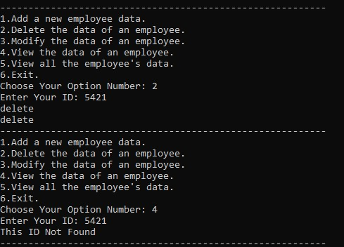

# C and Embedded C NTI Course

# Employee Record System Project

## Eng: Omar Adel Shalaan

## ([Resume Repo](https://github.com/OmarAdelShalaan/My-Resume)) ([Linkedin Profile](https://www.linkedin.com/in/omar-adel-shalaan/)) 

## Code
- [main.c](./main.c)
- [APP.h](./APP.h)
- [APP.c](./APP.c)
- [LinkedList.h](./LinkedList.h)
- [LinkedList.c](./LinkedList.c)  
- [DataEmployee.h](./DataEmployee.h)
- [makefile](./makefile) 

### Functios 

### Try Project 
- [Employee_Record_System.exe](./Employee_Record_System.exe)
		
