# C and Embedded C NTI Course 

## Week 1:
- ###  Introduction to embedded systems.
- ###  Some of the possible career tracks of embedded system.
- ###  Programming languages overview.
- ###  C programming intro. And history.
- ###  Why C Programming for embedded apps.
- ###  Writing first program in c and make the proper setups.
- ###  C file structure.
- ###  Data types in C.
- ###  Variables.
- ###  C Operators. (Arithmetic-bitwise-logic...etc)
- ###  Casting in C.
- ###  Labs.
- ###  Assignment for the next week.

## Labs
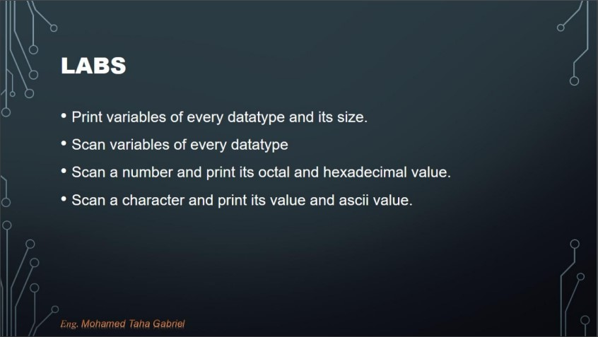

### [lab_1_1and2.c](./lab_1_1and2.c)
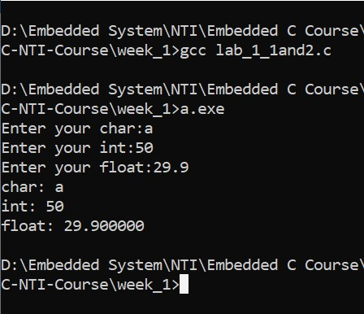

### [lab_1_3.c](./lab_1_3.c)
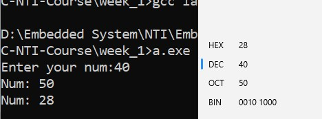

### [lab_1_4.c](./lab_1_4.c)
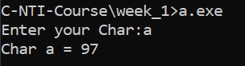

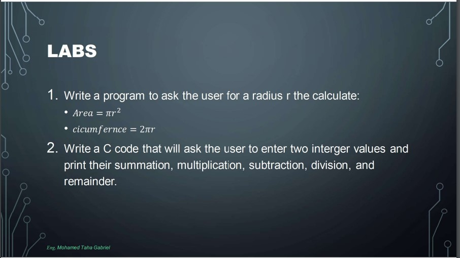

### [lab_2_1_1.c](./lab_2_1_1.c)
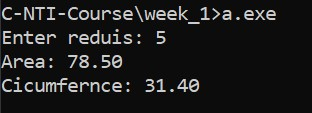

### [lab_2_1_2.c](./lab_2_1_2.c)
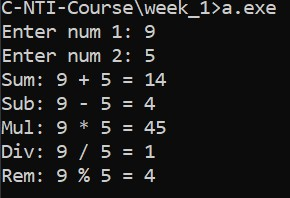

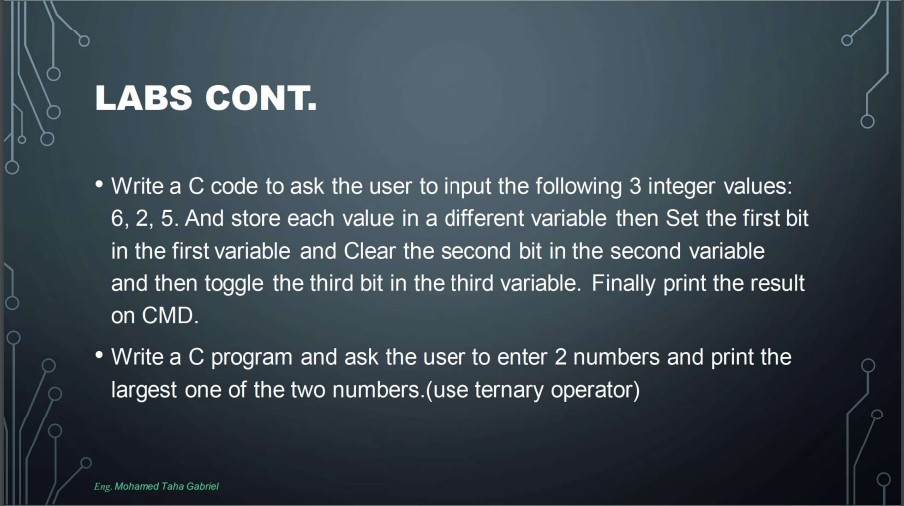

### [lab_2_2_1.c](./lab_2_2_1.c)
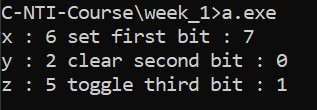

## Assignment

### [ass_1.c](./ASS_1.c)
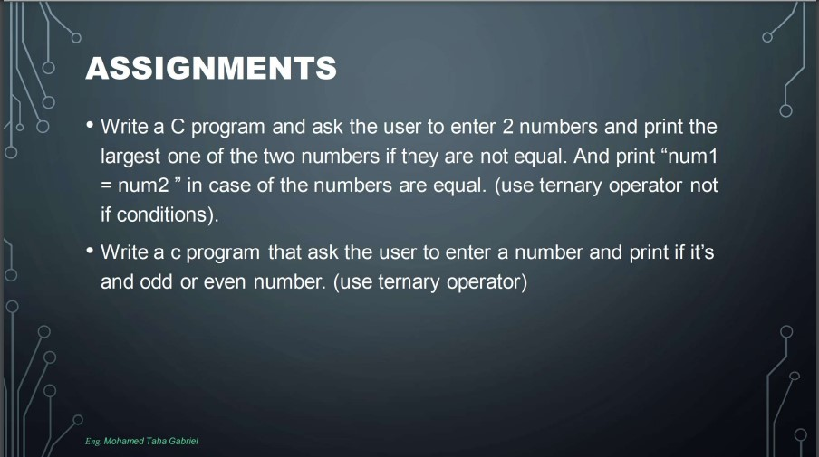
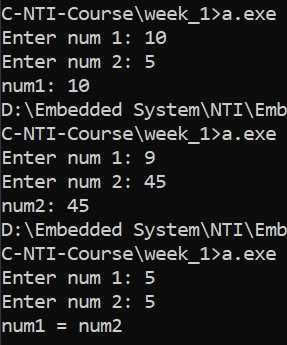

### [ass_2.c](./ASS_2.c)
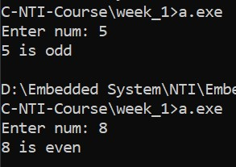