# C and Embedded C NTI Course 

## Week 2:
- ### Control flow statements (condition branching, looping, and jumping)
- ### Labs.
- ### Assignment for the next week.

## Labs
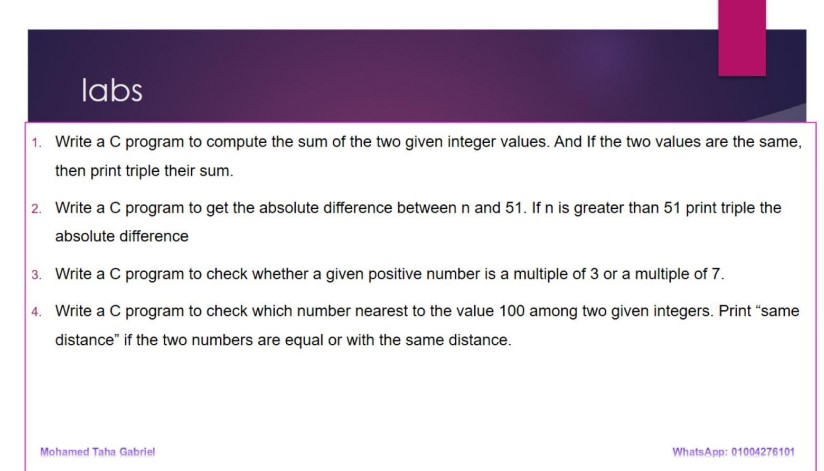

### [lab_1_1_01.c](./lab_1_1_01.c)
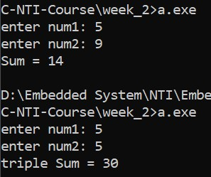

### [lab_1_1_02.c](./lab_1_1_02.c)
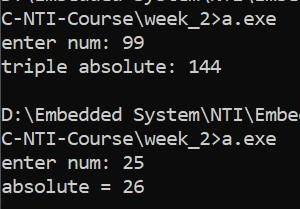

### [lab_1_1_03.c](./lab_1_1_03.c)
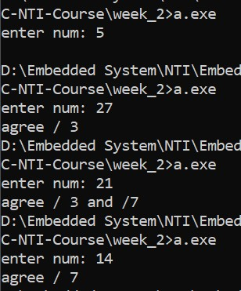

### [lab_1_1_04.c](./lab_1_1_04.c)
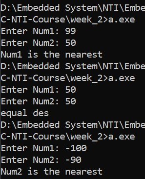

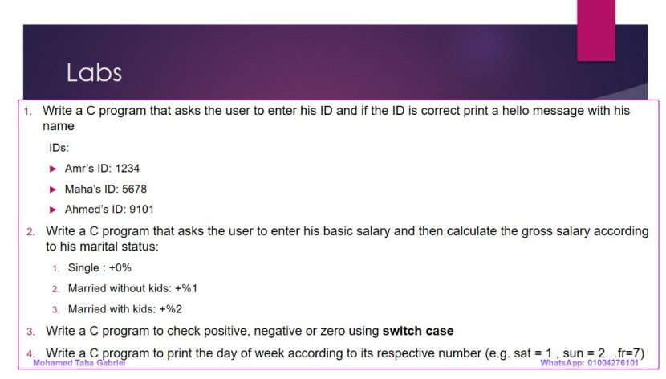

### [lab_1_2_01.c](./lab_1_2_01.c)
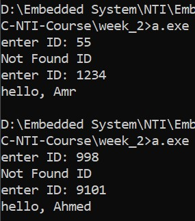

### [lab_1_2_02.c](./lab_1_2_02.c)

### [lab_1_2_03.c](./lab_1_2_03.c)
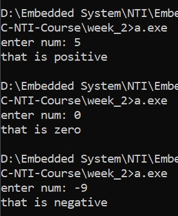

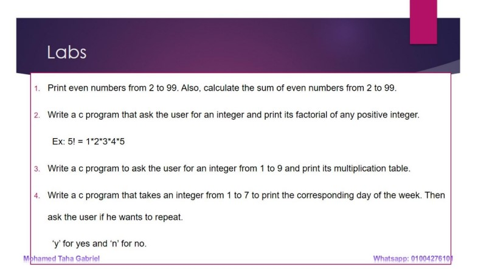

### [lab_2_1_01.c](./lab_2_1_01.c)
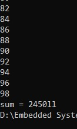

### [lab_2_1_02.c](./lab_2_1_02.c)
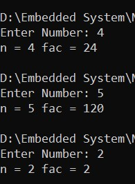

### [lab_2_1_03.c](./lab_2_1_03.c)
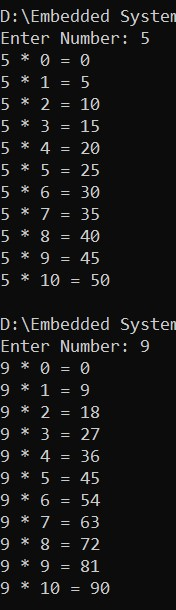

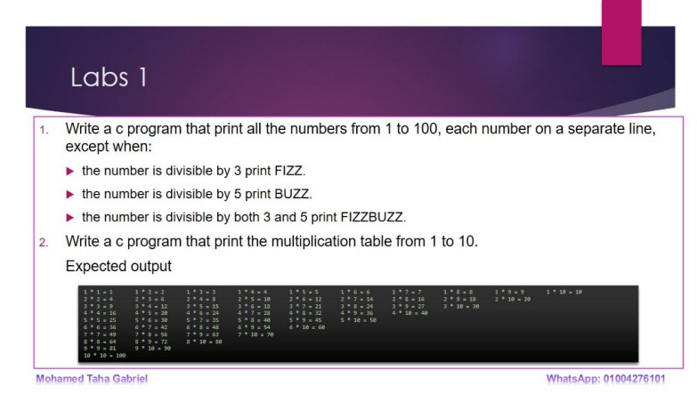

### [lab_2_2_01.c](./lab_2_2_01.c)
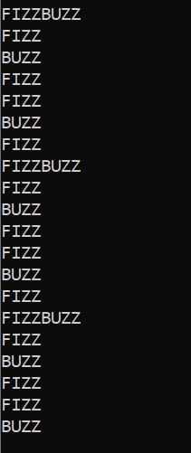

### [lab_2_2_02.c](./lab_2_2_02.c)
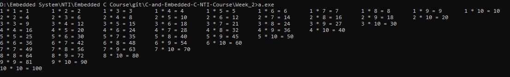

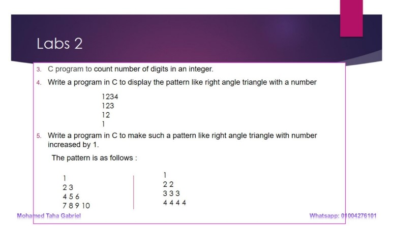

### [lab_2_3_03.c](./lab_2_3_03.c)
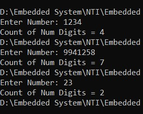

### [lab_2_3_04.c](./lab_2_3_04.c)
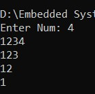

### [lab_2_3_05_1.c](./lab_2_3_05_1.c)
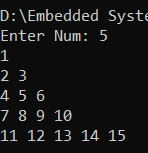

### [lab_2_3_05_2.c](./lab_2_3_05_2.c)
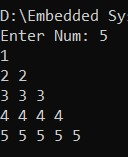

