# C and Embedded C NTI Course 

## Week 3:
-  Memory layout of C programs
-  Functions
-  Variables scope and lifetime.
-  Arrays
-  Labs.
-  Assignment for the next week.

## Labs
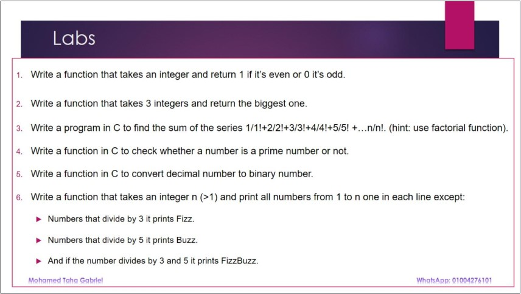

### [lab_1_1.c](./lab_1_1.c)
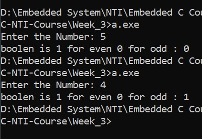

### [lab_1_2.c](./lab_1_2.c)
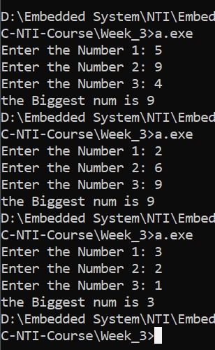

### [lab_1_3.c](./lab_1_3.c)
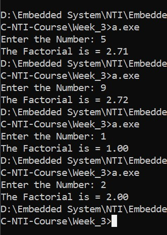

### [lab_1_5.c](./lab_1_5.c)
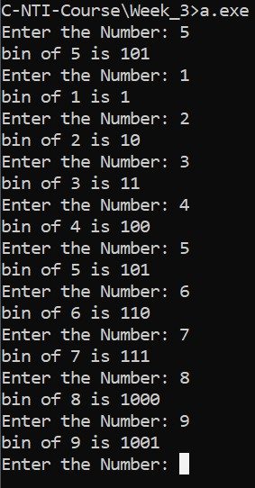

### [lab_1_6.c](./lab_1_6.c)
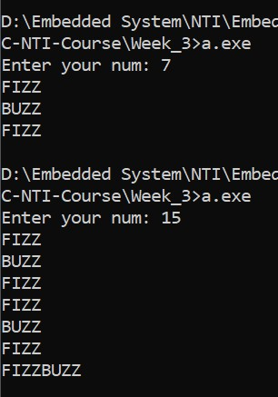

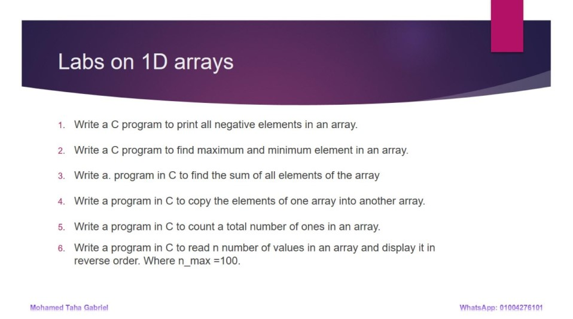

### [lab_1_2_01.c](./lab_1_2_01.c)

### [lab_1_2_02.c](./lab_1_2_02.c)

### [lab_1_2_03.c](./lab_1_2_03.c)

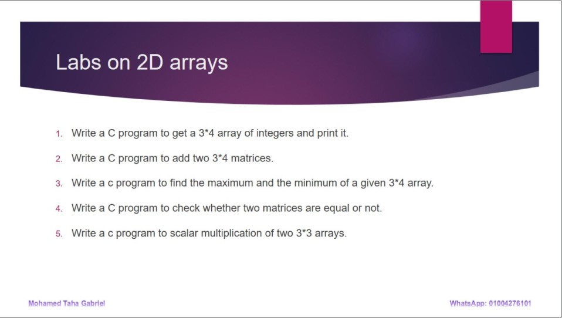

### [lab_2_1_1.c](./lab_2_1_1.c)
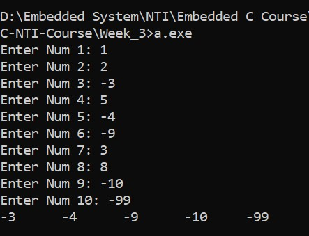

### [lab_2_1_2.c](./lab_2_1_2.c)
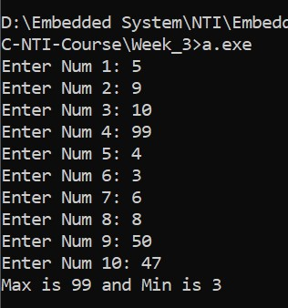

### [lab_2_1_3.c](./lab_2_1_3.c)
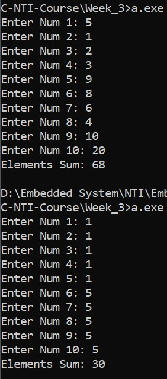

### [lab_2_1_4.c](./lab_2_1_4.c)
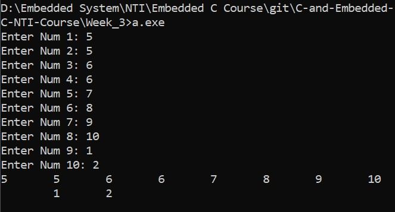

### [lab_2_1_5.c](./lab_2_1_5.c)
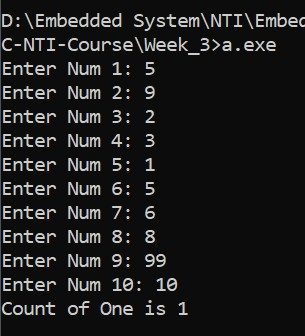

### [lab_2_1_6.c](./lab_2_1_6.c)
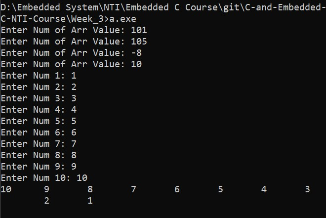

### [lab_2_2_1.c](./lab_2_2_1.c)
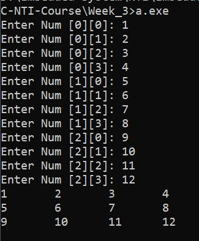

### [lab_2_2_2.c](./lab_2_2_2.c)
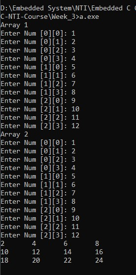

### [lab_2_2_3.c](./lab_2_2_3.c)
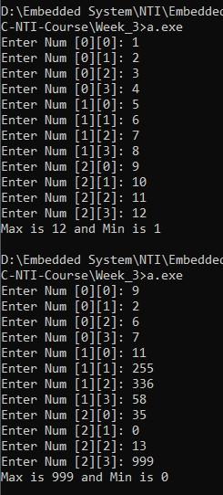

### [lab_2_2_4.c](./lab_2_2_4.c)
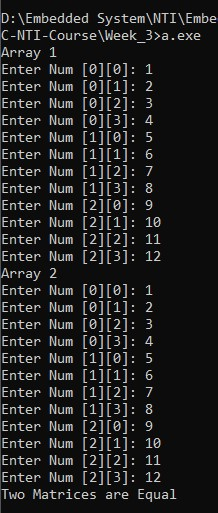
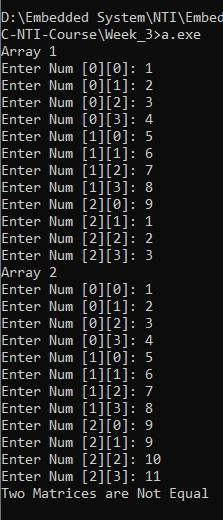

### [lab_2_2_5.c](./lab_2_2_5.c)

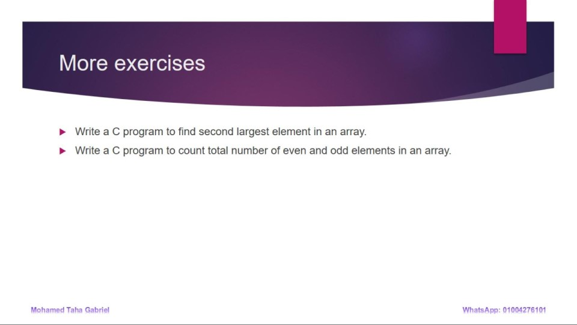

## Assignment

### [ass_1.c](./ass_1.c)
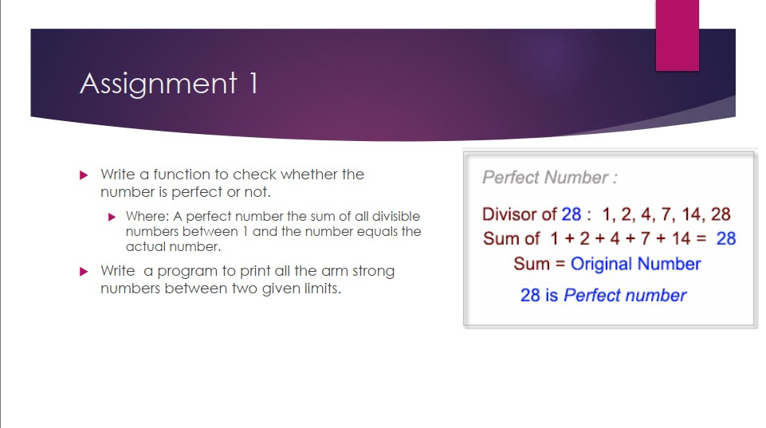
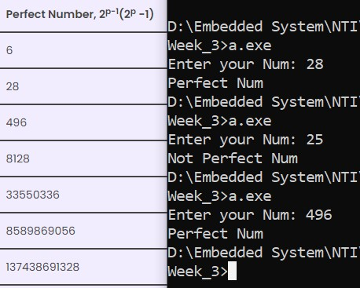

### [ass_2.c](./ass_2.c)
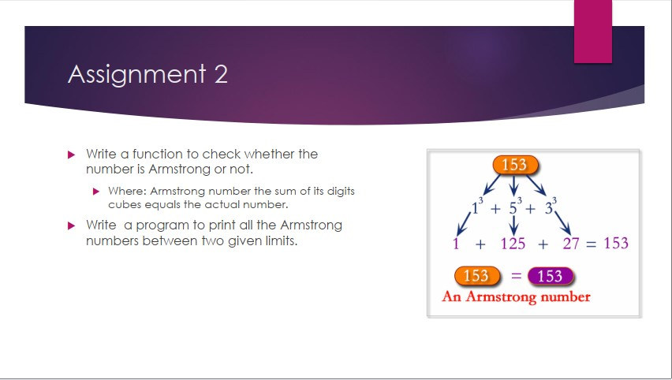
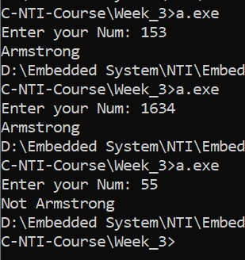

### [ass_3.c](./ass_3.c)
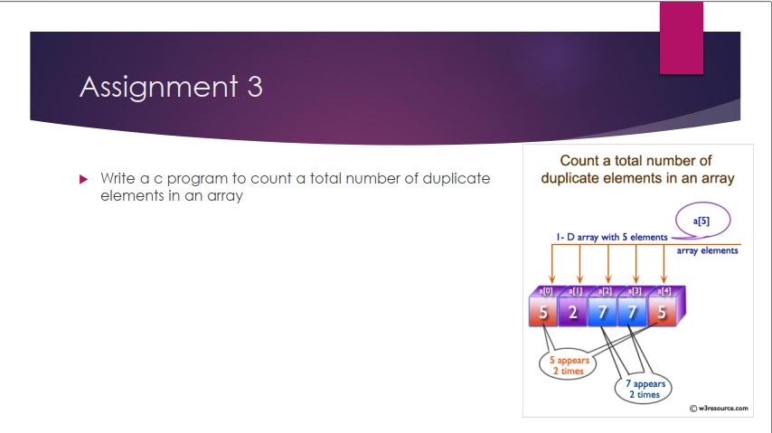
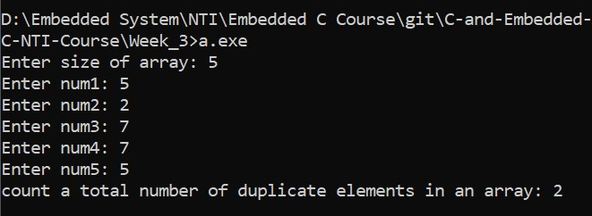