# C and Embedded C NTI Course 

# C and Embedded C NTI Course 

## Week 4:
-   Pointers in C.
-   Labs.
-   Assignment for the next week.

## Labs
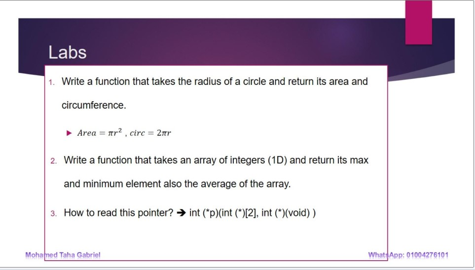

### [lab_1_1.c](./Lab_1/lab_1_1.c)
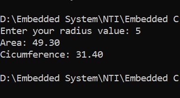

### [lab_1_2.c](./Lab_1/lab_1_2.c)
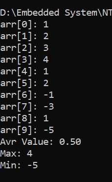

### [lab_1_3.txt](./Lab_1/lab_1_3.txt)
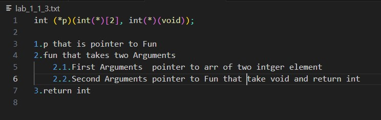

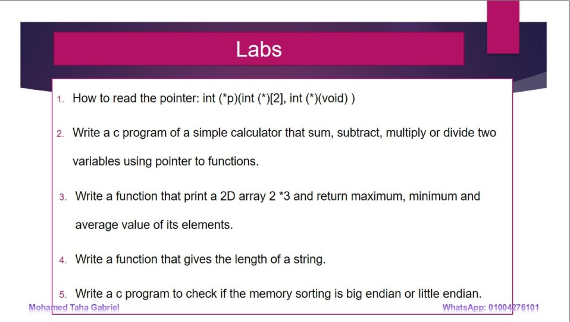

### [lab_2_1_4.c](./Lab_2/lab_2_1_4.c)
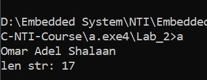

### [lab_2_1_5.c](./Lab_2/lab_2_1_5.c)
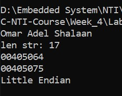

## Assignment

### [ass_1.c](./ASS/ass_1.c)
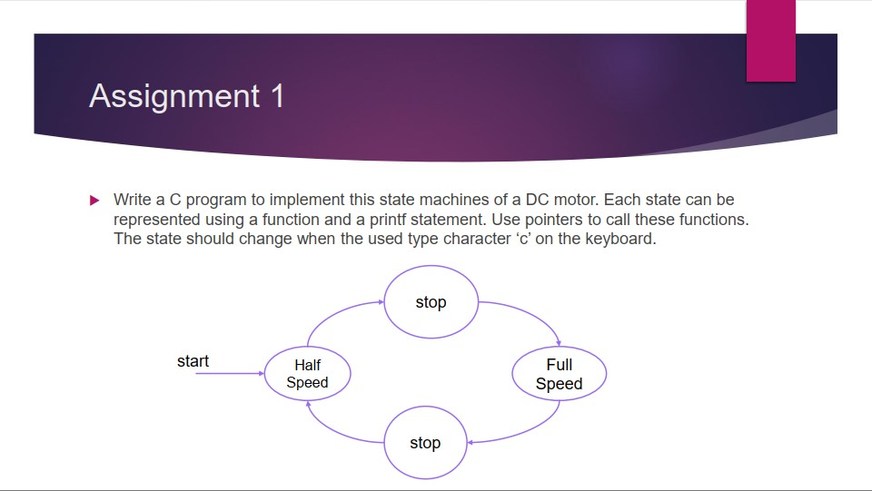
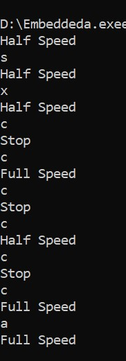

### [ass_2.c](./ASS/ass_2.c)
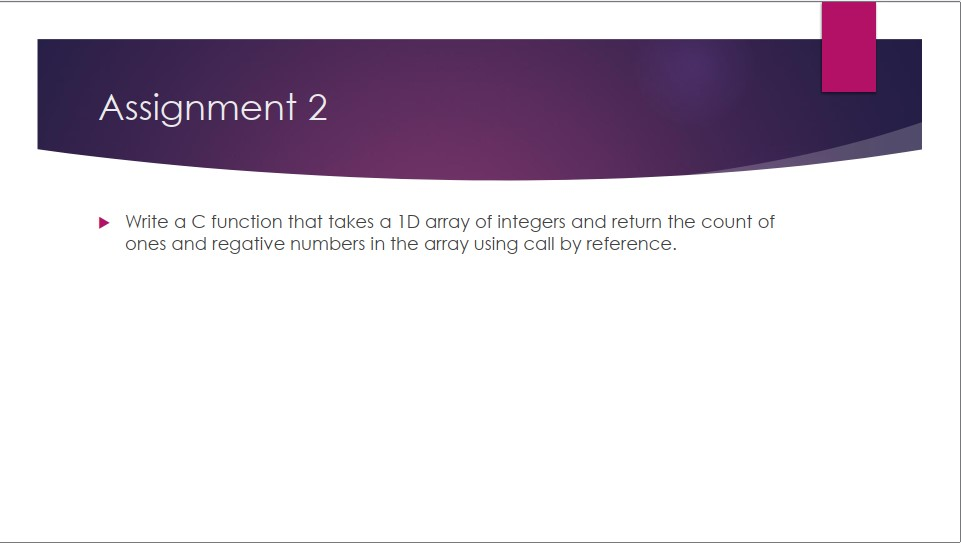
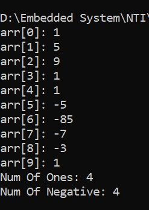

