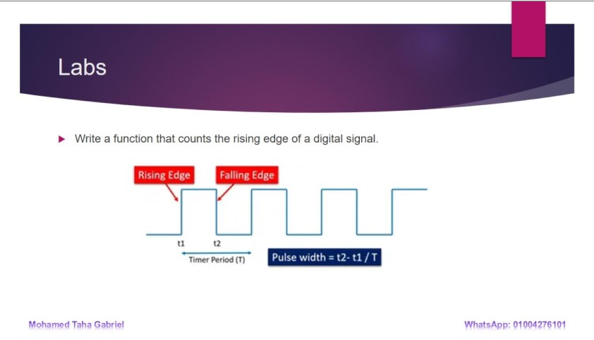
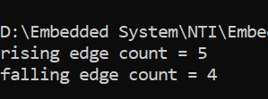
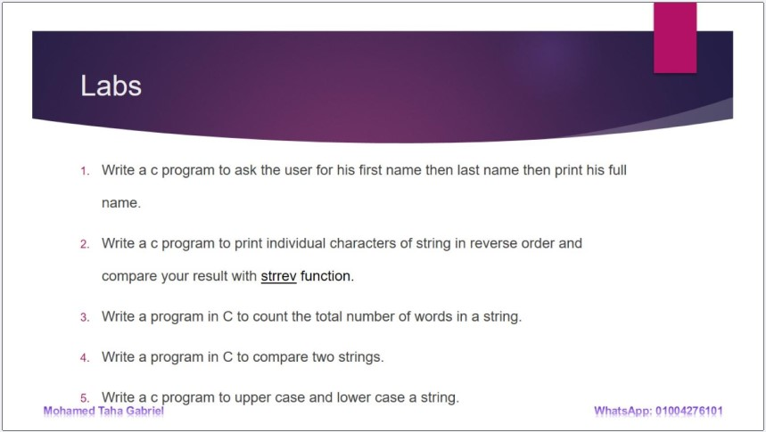
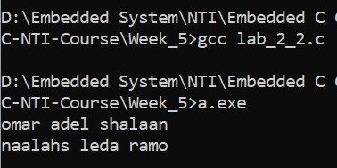
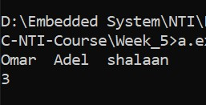
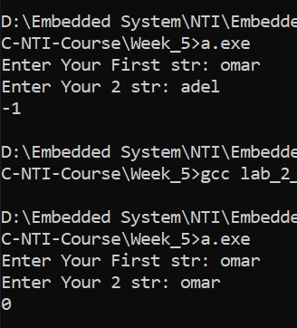
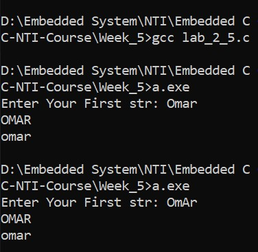
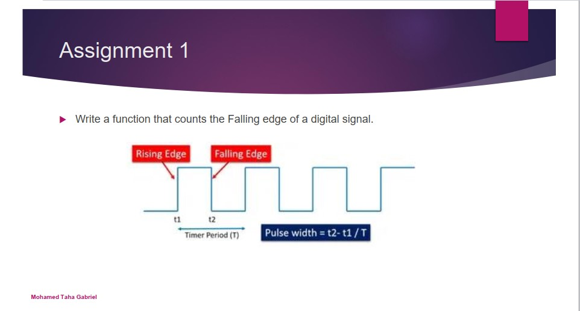
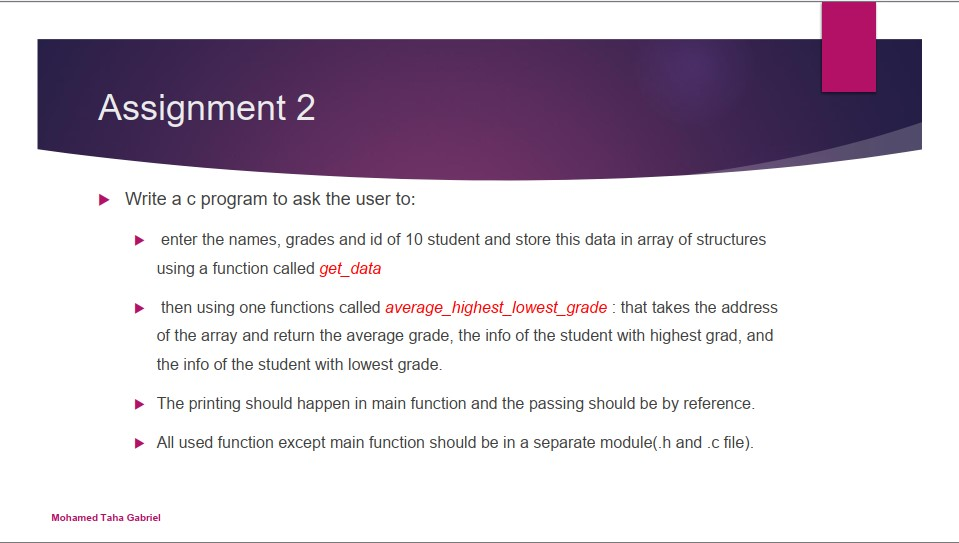
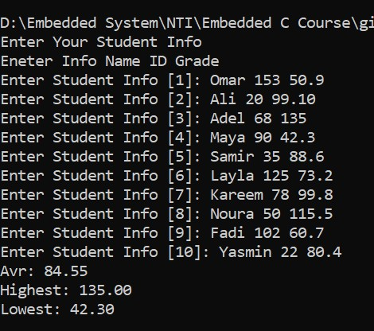

# C and Embedded C NTI Course 

## Week 5:
-   Data modifiers in C ( sign, size, storage, etc).
-   Constant and Volatile keywords
-   Typedef
-   Strings in C
-   Structures in C
-   Labs.
-   Assignment.

## Labs

### [lab_1_1.c](./lab_1_1.c)

### [lab_2_2.c](./lab_2_2.c)

### [lab_2_3.c](./lab_2_3.c)

### [lab_2_4.c](./lab_2_4.c)

### [lab_2_5.c](./lab_2_5.c)

## Assignment

### [ass_1.c](./lab_1_1.c)

### [ass_2.c](./lab_3.c)

