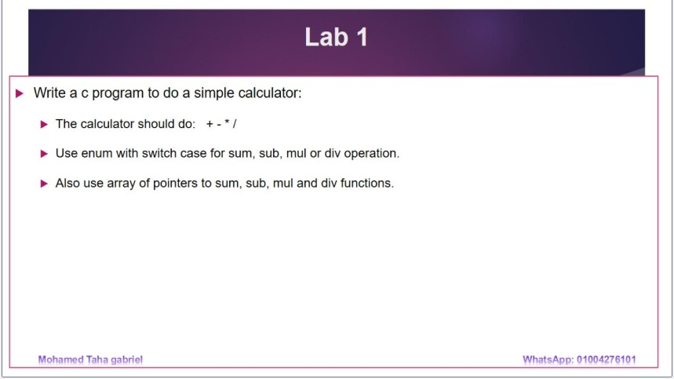
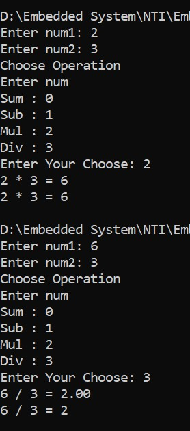
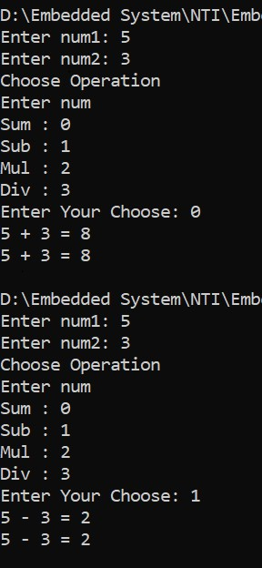
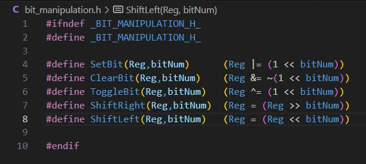
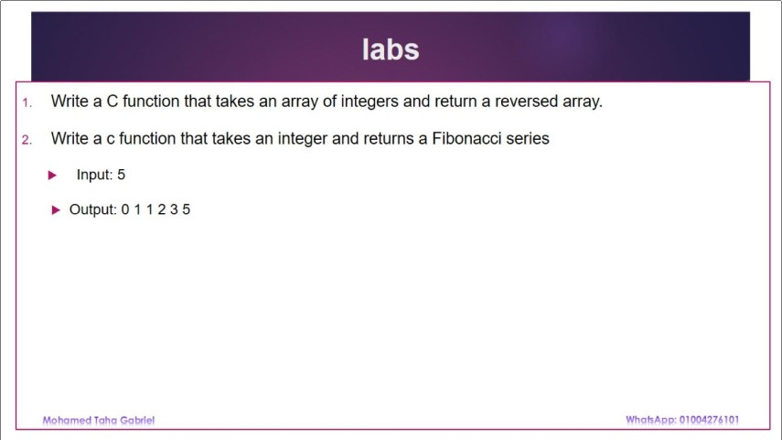
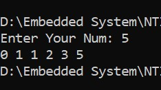

# C and Embedded C NTI Course 

## Week 6:
-   Bit-fields.
-   Unions.
-   Enumerations.
-   Preprocessor directives.
-   Memory management in C.
-   Labs.
-   Assignment.

## Labs

### [lab_1_1.c](./lab_1.c)

### [bit_manipulation.c](./bit_manipulation.c)

### [Fibonacci_series.c](./Fibonacci_series.c)

